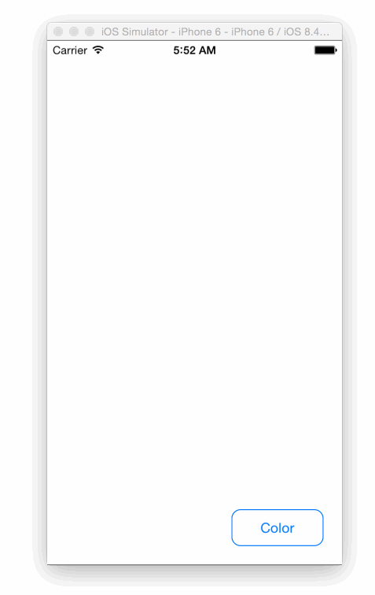

# Status: Archived
This repository has been archived and is no longer maintained.


# This is a legacy Firebase example (for SDK 2.x.x). You probably want one of the [up-to-date examples](https://firebase.google.com/docs/samples).

---------------------

# Firebase Shared Drawing

This iOS app demonstrates the use of the [Firebase SDK](https://firebase.com/) to create a shared drawing
canvas. Multiple users can run the app and draw on the same canvas. Line segments are synchronized as the user draws them. It is compatible with the [Android drawing app](https://github.com/firebase/AndroidDrawing/).

This example is intended to demonstrate how you can adapt single-user applications to be collaborative with the help of Firebase. Create your own [Firebase](https://firebase.com/) and incorporate these techniques into your own application!

## Install
This project uses [CocoaPods](https://cocoapods.org/) to manage all the necessary SDKs. Run the following command to install the dependencies.

```bash
pod install
```

## Dependencies
#### [Firebase](https://firebase.com/)
#### [NKO Color Picker](https://github.com/FWCarlos/NKO-Color-Picker-View-iOS)

### Demo


